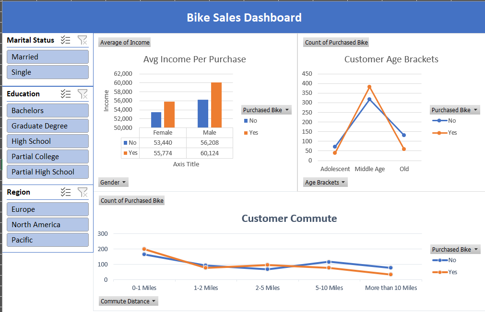

# 🏍️ Bike Sales Analysis Dashboard (Excel)

## 📌 Project Overview
This project focuses on analyzing bike sales data to understand customer demographics, purchasing behavior, and key factors influencing bike purchases. The analysis is performed entirely in **Microsoft Excel**, using data cleaning, pivot tables, and interactive dashboards to generate insights.

The final output is a dynamic Excel dashboard that allows users to explore trends across income, age, gender, commute distance, and marital status.

---

## 🎯 Objectives
- Identify customer segments more likely to purchase bikes
- Analyze the impact of income, age, and commute distance on bike purchases
- Create an interactive dashboard for quick business insights
- Practice end-to-end data analysis using Excel

---

## 🗂 Dataset
- **Source:** Public bike sales dataset
- **Data Type:** Customer & sales-related data
- **Key Fields:**
  - Age
  - Gender
  - Income
  - Marital Status
  - Education
  - Commute Distance
  - Purchased Bike (Yes/No)

---

## 🛠 Tools & Techniques Used
- **Microsoft Excel**
  - Data Cleaning & Formatting
  - Pivot Tables
  - Pivot Charts
  - Slicers
  - Conditional Formatting
  - Dashboard Design

---

## 📈 Dashboard Features
The dashboard provides insights through interactive visual elements:

### 👥 Customer Demographics
- Bike purchases by gender
- Purchases by marital status
- Age group distribution of customers

### 💰 Income & Purchasing Trends
- Average income comparison between customers who purchased vs did not purchase bikes
- Income trends segmented by gender

### 🚲 Commute & Behavior Analysis
- Impact of commute distance on bike purchases
- Purchase likelihood across different commute ranges

### 🎛 Interactivity
- Slicers for:
  - Marital Status
  - Region
  - Education
- Enables quick filtering and comparison

---

## 🔍 Key Insights
- Customers with higher average income are more likely to purchase bikes
- Middle-aged customers show higher purchase rates compared to younger and older groups
- Short to medium commute distances correlate with higher bike purchases
- Married customers tend to purchase bikes more frequently than single customers

---

## 📊 Dashboard Preview

---

## 🚀 Learnings & Takeaways
- Strengthened understanding of Excel-based data analysis workflows
- Gained experience building interactive dashboards using pivot tables and slicers
- Learned how to extract actionable insights from customer sales data
- Improved data visualization and storytelling skills

---

## 📌 Future Enhancements
- Add more advanced Excel formulas for deeper analysis
- Perform the same analysis using Power BI or Python
- Include time-based sales trends if date data is available

---

## 👤 Author
**Sucharita Samantaray**  
Aspiring Data Analyst | Computer Engineering Student  

📌 This project is part of my data analytics learning journey.

